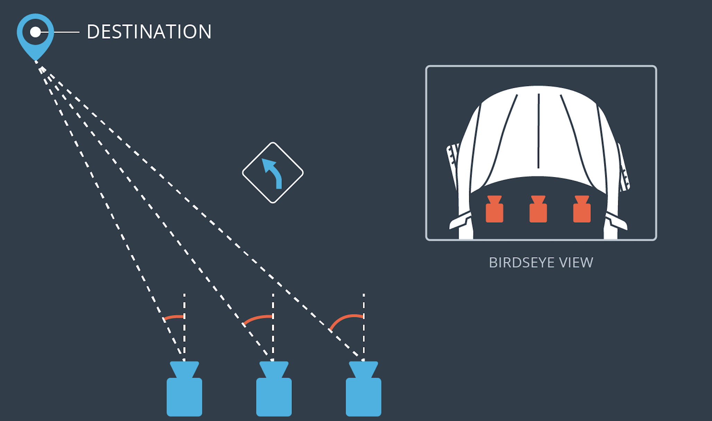
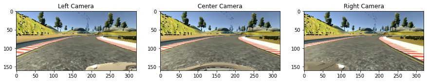
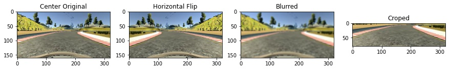
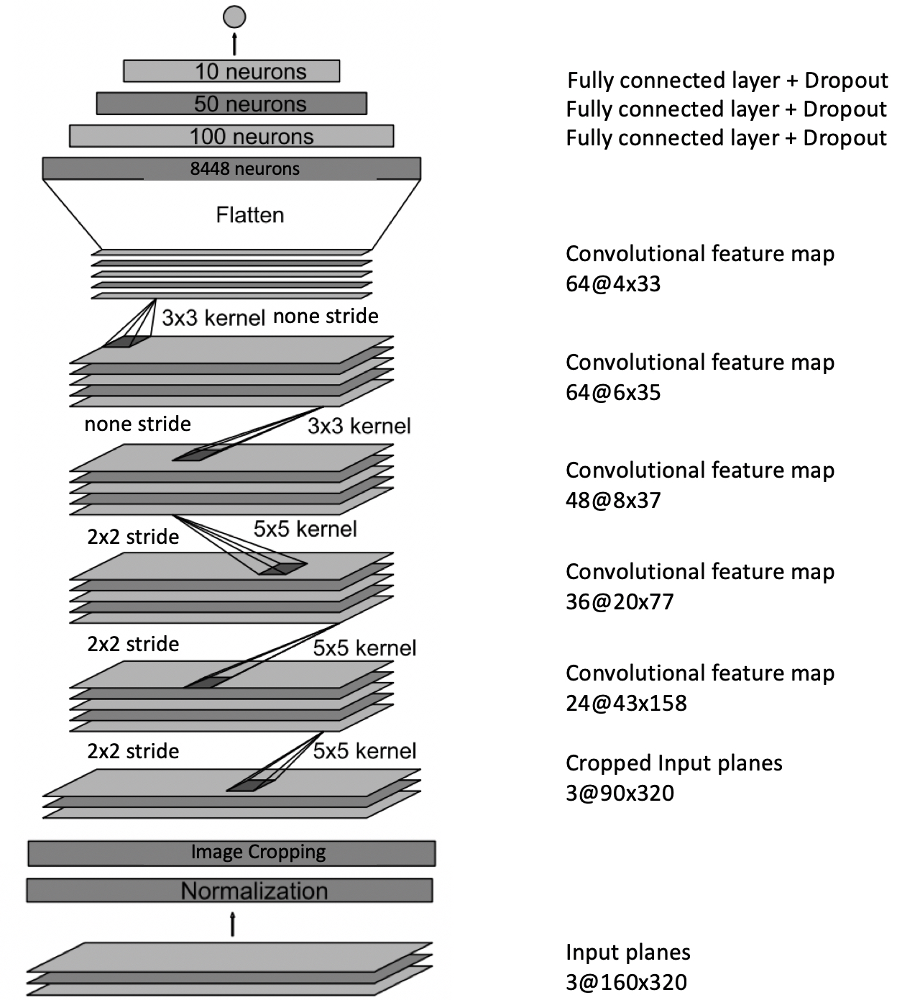

# Behavioral Cloning Project

[](http://www.udacity.com/drive)

Overview
---
<figure>
 
 <figcaption>
 <p></p> 
 <p style="text-align: center;"> Fig: Autonomous Drive in the Simulator</p> 
 </figcaption>
</figure>
 <p></p>

**In this project, i learned about deep neural networks and convolutional neural networks to clone driving behavior. I train, validate and test the neuronal network model using Keras.**

Following files are stored in the repository:

* model.py (script used to create and train the model)
* drive.py (script to drive the car)
* video.py (script to crate the mp4 video from single recorded images)
* model.h5 (a trained Keras model)
* a report writeup file
* video.mp4 (a video recording of your vehicle driving autonomously around the track)
* SimulatroDrive_Cut.mp4 (video.mp4 in the simulator view, gives a better first impression)

The Project
---
The goals / steps of this project are the following:
1. Use the simulator to collect data of good driving behavior 
2. Design, train and validate a model that predicts a steering angle from image data
3. Validation, use the model to drive the vehicle autonomously around the first track in the simulator.

## 1. Data collection

To collect the data, the vehicle is driving for one course in the simulation. To extend the collect able data, the course is recorded with three cameras. The mounting positions are seen in Fig. 1.1.  To train the model later, every image sequence is saved the current steering angle. So that the model can learn the position relative to the steering angle. To compensate the offset between the side cameras and the steering angle, seen on the top right side if Fig. 1.1, an additional offset ```+-20%```


<figure>
 
 <figcaption>
 <p></p> 
 <p style="text-align: center;"> Fig. 1.1: Visualization camera positions</p> 
 </figcaption>
</figure>
 <p></p>

<figure>
 
 <figcaption>
 <p></p> 
 <p style="text-align: center;"> Fig. 1.2: Data Collegetion</p> 
 </figcaption>
</figure>
 <p></p>

The data argumentations process and preprocessing can be seen in Fig. 1.3. The data gets extended by flipping the images and blurring the images. so that in the end 1/3 of the data is from the track collected, 1/3 flipped and the rest blurred. This is done due to generalize the model more. To accelerate the training process, the unnecessary parts of the image that contain any relevant information get cropped. So that the model has to process less image data. This is done with this simple line of code `model.add(Cropping2D(cropping=(50,20), (0,0)))`

<figure>
 
 <figcaption>
 <p></p> 
 <p style="text-align: center;"> Fig. 1.3: Data Collegetion</p> 
 </figcaption>
</figure>
 <p></p>

## 2. Model

The model outputs a steering angle to an autonomous vehicle.

My final model results were:
* training set accuracy of 99.4%
* validation set accuracy of 93.8%
* test set accuracy of 91.9%

**Architecture** As architecture has been chosen the architecture from the Nvidia End to End Learning [Paper](https://arxiv.org/abs/1604.07316). The use case is the same and there for its convenient to begin with the same architecture and then adapt if the net has to be modified. But since it’s the same use case and the same data no big modifications have to be done. As modification a cropped layer and three dropout layers are added at the fully connected layers. Fig. 


<figure>
 
 <figcaption>
 <p></p> 
 <p style="text-align: center;"> Fig. 2.1: Net</p> 
 </figcaption>
</figure>
 <p></p>

**Model Parameters** 
The model is trained with following parameters:

* EPOCHS = 7
* BATCH_SIZE = 512
* dropout = 0.5
* learning rate = 0.001
* optimizer: AdamOptimizer
* 20% data split for validation

The Training too place on an external GPU. Therefore, the Batch Size have been optimized to the highest possible number, before the Computer crashes, due the face its running out of memory. The Dropout rate is the lowest recommended but it lead’s still to an light overfitting since validation and training accuracy divergent, seen in Fig. 2.2. This also shows us that the learning rate could be reduce could so that the net is more generalize.

<figure>
 
 <figcaption>
 <p></p> 
 <p style="text-align: center;"> Fig. 2.2: Training and Validation accurancy.</p> 
 </figcaption>
</figure>
 <p></p>


**Problem Solving Approach** An iterative approach have been taken. The model architecture above has been chosen and it started by training the model with the data of one track and one round. After every of the following steps the training and validation accuracy have been analyzed as well as the autonomous driving performance on the training. 

1. Then the learning rate was reduced due to high overfitting. 
2. The training data was augmented, to reduce the overfitting. This increased the validation accuracy a lot. But still the vehicle could not perform on autonomous track. 
3. Including three dropout layers at the fully connected layer. This increased the validation accuracy much more and let the vehicle drive the track autonomously.

## 3. Validation

For the validation of the performance are two videos created from simulator:

1. One video in the camera view of the vehicle. [Link](video.mp4)
2. One video from the birth perspective with the data of the steering angle and the speed of the car. So the vehicle behavior can be better judged. [Link](SimulatorDrive_Cut.mp4)

### Improvements:

Additional Data from the second track should be recorded. This would lead to less overfitting, since more data is available. Also, to a higher generalization because more data qualify through more variance in the images. Therefore, also the artificial augmented data can be reduced. The suggestion would be to reduce the blurred data because the net is for this use case just trained for the simulator and there will be always a high image resolution available. From the engineering fundamentals: As accurate as necessary as imprecise as possible.

---
### Dependencies
This lab requires:

* [CarND Term1 Starter Kit](https://github.com/udacity/CarND-Term1-Starter-Kit)

The lab enviroment can be created with CarND Term1 Starter Kit. Click [here](https://github.com/udacity/CarND-Term1-Starter-Kit/blob/master/README.md) for the details.

## Details About Files In This Directory

### `drive.py`

Usage of `drive.py` requires the saved trained model as an h5 file, i.e. `model.h5`.  Once the model has been saved, it can be used with drive.py using this command:

```sh
python drive.py model.h5
```

The above command will load the trained model and use the model to make predictions on individual images in real-time and send the predicted angle back to the server via a websocket connection.

Note: There is known local system's setting issue with replacing "," with "." when using drive.py. When this happens it can make predicted steering values clipped to max/min values. If this occurs, a known fix for this is to add "export LANG=en_US.utf8" to the bashrc file.

#### Saving a video of the autonomous agent

```sh
python drive.py model.h5 run1
```

The fourth argument, `run1`, is the directory in which to save the images seen by the agent. If the directory already exists, it'll be overwritten.

```sh
ls run1

[2017-01-09 16:10:23 EST]  12KiB 2017_01_09_21_10_23_424.jpg
[2017-01-09 16:10:23 EST]  12KiB 2017_01_09_21_10_23_451.jpg
[2017-01-09 16:10:23 EST]  12KiB 2017_01_09_21_10_23_477.jpg
[2017-01-09 16:10:23 EST]  12KiB 2017_01_09_21_10_23_528.jpg
[2017-01-09 16:10:23 EST]  12KiB 2017_01_09_21_10_23_573.jpg
[2017-01-09 16:10:23 EST]  12KiB 2017_01_09_21_10_23_618.jpg
[2017-01-09 16:10:23 EST]  12KiB 2017_01_09_21_10_23_697.jpg
[2017-01-09 16:10:23 EST]  12KiB 2017_01_09_21_10_23_723.jpg
[2017-01-09 16:10:23 EST]  12KiB 2017_01_09_21_10_23_749.jpg
[2017-01-09 16:10:23 EST]  12KiB 2017_01_09_21_10_23_817.jpg
...
```

The image file name is a timestamp of when the image was seen. This information is used by `video.py` to create a chronological video of the agent driving.

### `video.py`

```sh
python video.py run1
```

Creates a video based on images found in the `run1` directory. The name of the video will be the name of the directory followed by `'.mp4'`, so, in this case the video will be `run1.mp4`.

Optionally, one can specify the FPS (frames per second) of the video:

```sh
python video.py run1 --fps 48
```

Will run the video at 48 FPS. The default FPS is 60.

